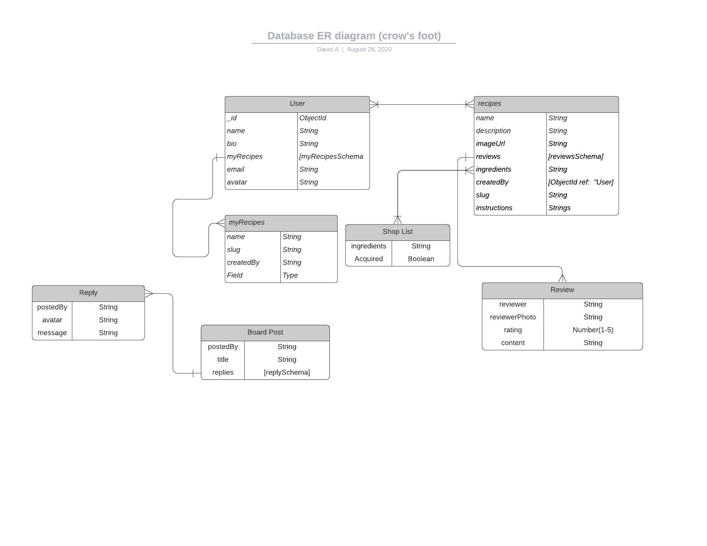
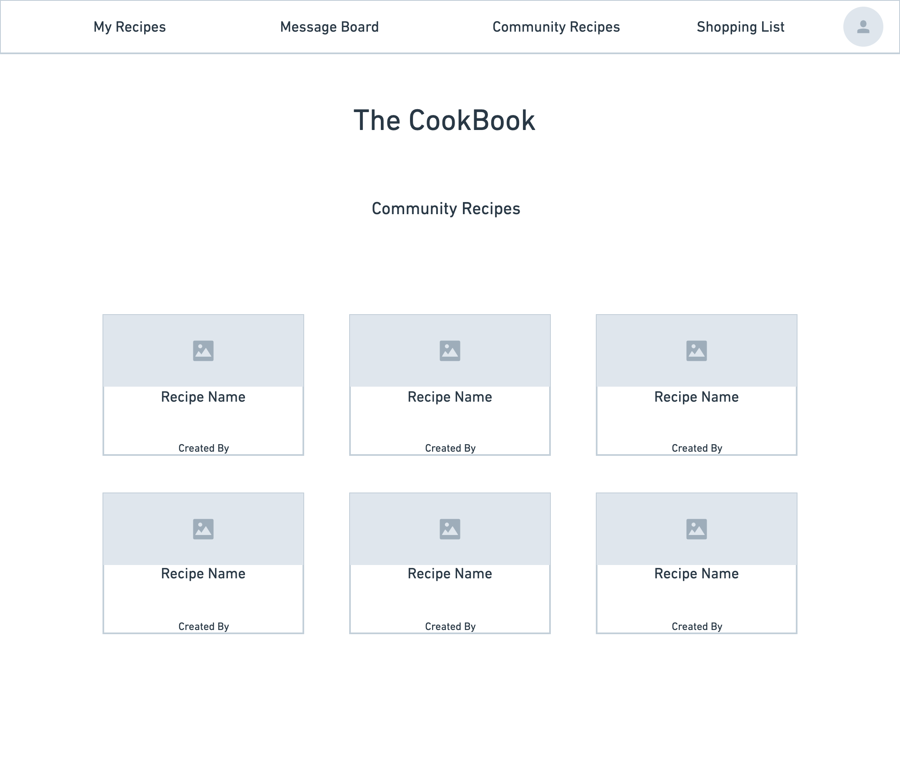
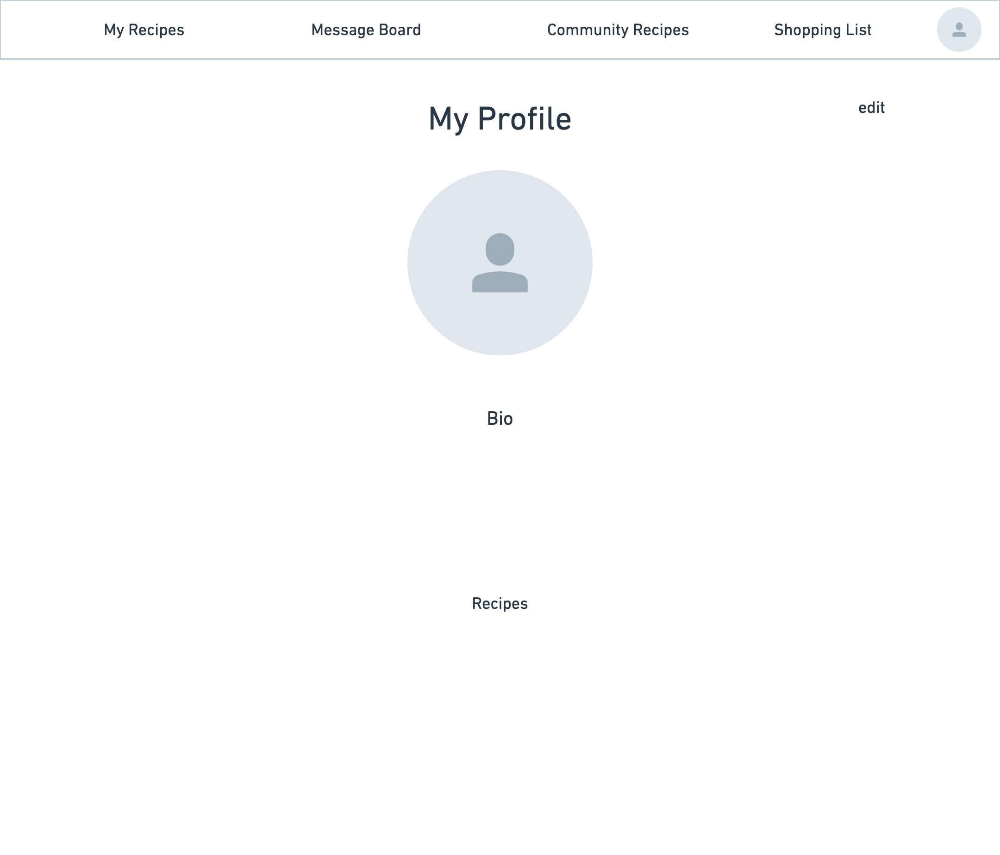
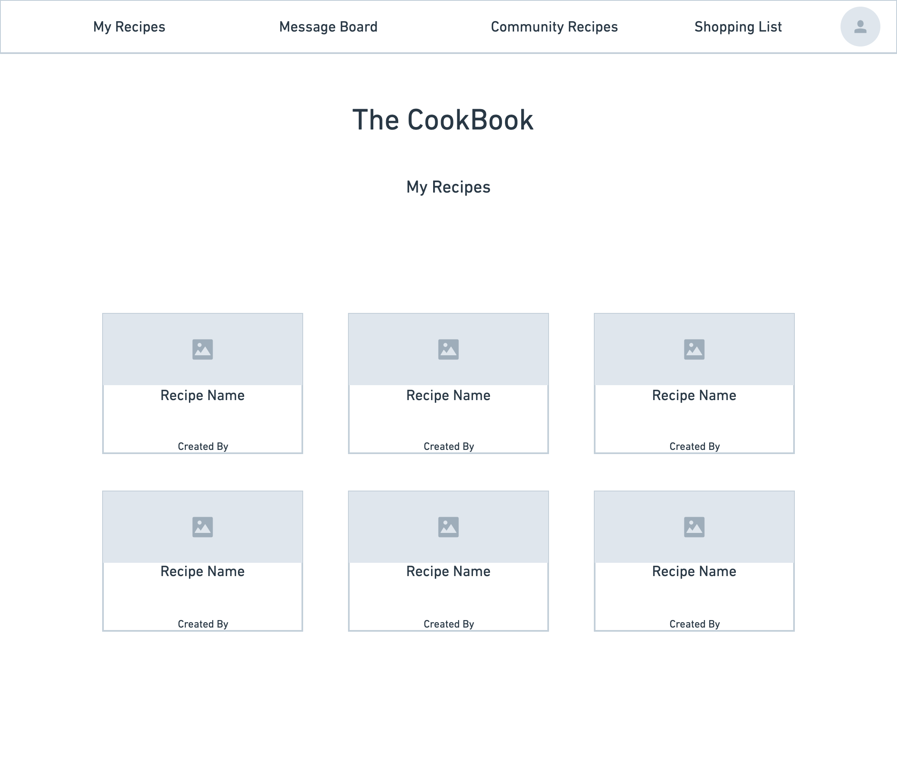
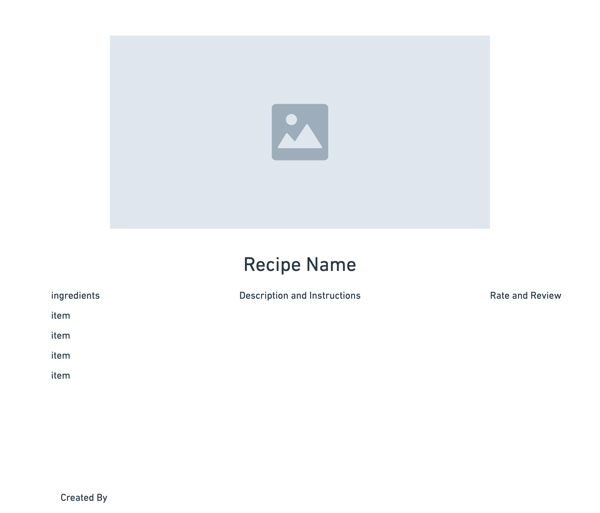
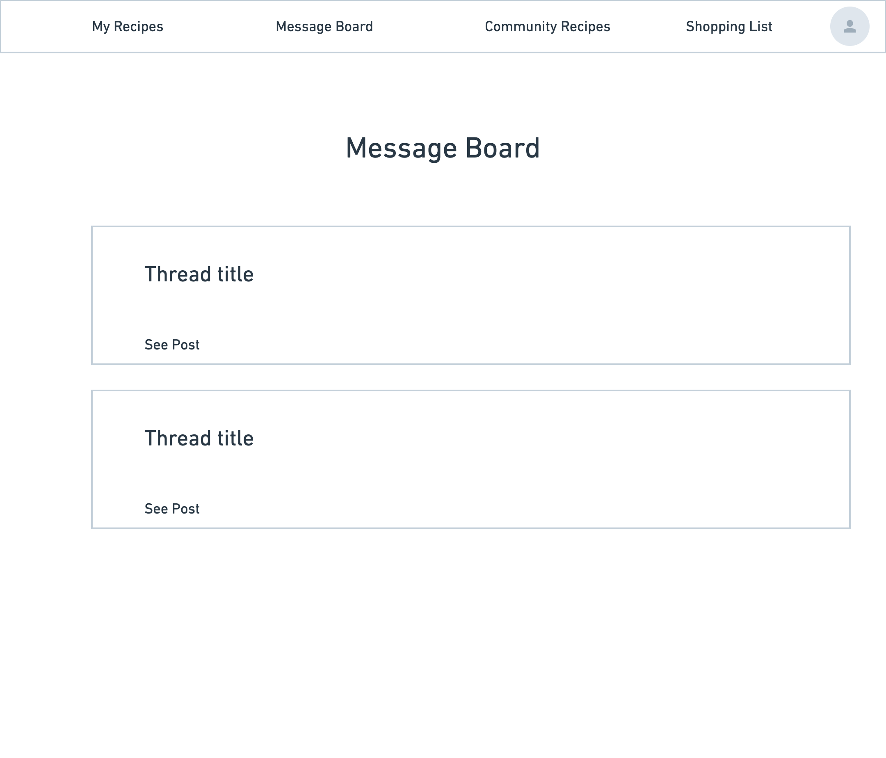

# The Potluck
## Community Recipe Sharing App
### Motivation:

Cooking has always been a passion of mine since I was a child being so eager to flip burgers my mom made in the frying pan. Since becoming vegan over 6 years ago I've expanded my cooking knowledge and experience by collecting cookbooks and experimenting with ingredients. Although reading cookbooks are helpful, having a community filled with people from different places and cultures sharing their recipes within one source would help expand the knowledge of cooking not just for me but for everyone else that takes part in that community. This is the motivation that fuels this app.

### Run Application
https://the-potluck.herokuapp.com/

### User Stories
* AAU I want to be able to sign in using an authentication
* AAU I want to create a recipe that will be submitted to my recipe list and the community recipe board
* AAU I want to add recipes from the community recipe list to my recipe list
* AAU I want to rate and review a recipe
* AAU I want to be able to delete recipes from my list 
* AAU I want to have a list of the ingrdients from a recipe in order to acquire them for myself to make the recipe 
* AAU I want to have the ability to filter recipes
* AAu I want to see who the recipe is created by
* AAU i want to see a susers profile with recipes on their list in any 
* AAU i want to see a users profile with recipes on their list if any
* AAU I want to write on a message board to discuss recipes
* AAU I want to see recipes ordered by most recently added

#### Psuedo Code

1. create user model
2. create recipe model
3. get a route to show recipes on community page 
4. make controller function for community page
5. create user view for profile
6. create route to show profile info
7. add profile info route to controller
8. add review route for recipes
9. add review route to controllers
10. create message index route and add to controller
11. add route to reply on message routed

## Tech Used
* Node Js
* Mongodb
* express
* MongooseJS
* MongoDB Atlas
* EJS Templating
* Heroku with NodeJS
* CSS
* Google OAuth 2.0
* PassportJS

## ERD

## Wireframes
#### Community Page

#### Profile Page

#### My Recipes Page

#### Recipe Page

#### Message Board 

## Stretch Goals
* Make a page to pull ingredients from a recipe into a shopping list
* Add filter feature to narrow down search for recipes
* create search bar to find recipes already on page 

